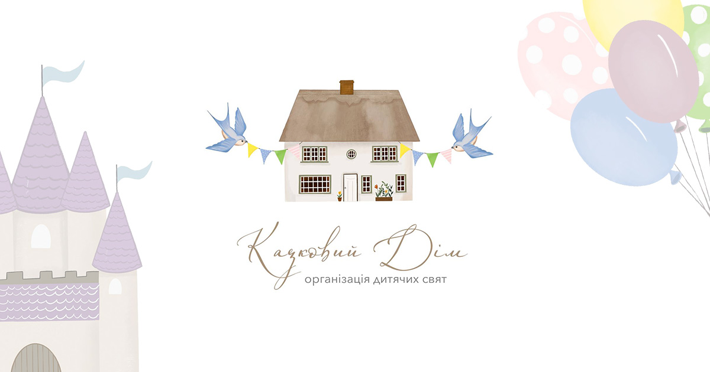

# Kazkoviy Dim

<p align="center">  </p>

## Table of contents

1. [Description](#description)
2. [Tech Stack](#tech-stack)
3. [Features](#features)
4. [Demo and Links](#demo-and-links)
5. [Project Structure](#project-structure)
6. [Sanity Integration](#firebase-configuration)
7. [Running the Project Locally](#running-the-project-locally)
8. [Author](#author)

## Description

**Kazkovyi Dim** is a website for a children's party agency with dynamic content.
Built with Next.js, Tailwind CSS, and Sanity CMS, the platform allows visitors to explore services, photos and information about entertainers.
The project also includes an admin panel for authorized users to manage content easily through Sanity Studio.

## Tech Stack

- **Next.js** – for building the frontend
- **Tailwind CSS** – for styling and responsive design
- **Sanity CMS** – for content management and admin editing
- **Vercel** – for deployment

## Features

- **Dynamic Content Management:** Easily update services, event details, and media via Sanity CMS
- **Authentication:** Only authorized users can log in to manage the content
- **Responsive UI:** Fully optimized for desktop and mobile
- **SEO Ready:** Metadata, OpenGraph tags, and structured content for better visibility

## Demo and Links

- View Live: [Kazkovyi Dim](https://kazkovyi-dim.vercel.app/)
- GitHub Repository: [GitHub Repository](https://github.com/IvanBodnarash/kazkovyi-dim)

## Project Structure

The repository contains two main folders:

```bash
/kazkovyi-dim-app   → Next.js app (user-facing website)
/studio-kazkovyi-dim     → Sanity Studio (CMS for managing content)
```

- **kazkovyi-dim-app:** contains all Next.js pages, components, and styles. Fetches content directly from Sanity via Sanity API.
- **studio-kazkovyi-dim:** includes schemas, desk structure, and Sanity Studio configuration for content editors.

## Sanity Integration

Sanity is connected to the frontend through the Sanity Client:

```ts
// kazkovyi-dim-app/src/client.ts
import { createClient } from "next-sanity";

export const client = createClient({
  projectId: "your-project-id",
  dataset: "production",
  apiVersion: "2025-01-01",
  useCdn: true,
});
```

In the frontend, content is fetched with GROQ queries:

```js
import { client } from "@/sanity/client";

export async function fetchEvents() {
  const EVENTS_QUERY = `*[_type == "events"] | order(publishedAt desc)[0...3]{
        _id,
        title,
        description,
        image,
        publishedAt
    }`;

  const options = { next: { revalidate: 30 } };

  return await client.fetch(EVENTS_QUERY, {}, options);
}
```

Sanity Studio (`/studio-kazkovyi-dim`) provides a UI for adding, editing, and deleting data, which is immediately reflected on the frontend.

Deployment has been done separately:

- **Frontend** - deployed on Vercel
- **Sanity Studio** - deployed on Sanity Hosting

## Running the Project Locally

### Prerequisites

- **Node.js** installed
- **Sanity CLI** installed (`npm install -g @sanity/cli`)
- **Vercel account** (optional for deployment)

### Steps

1. **Clone the repository**

``` bash
git clone https://github.com/IvanBodnarash/kazkovyi-dim
cd kazkovyi-dim
```

2. **Run the frontend**

```bash
cd frontend
npm install
npm run dev
```

3. `Run Sanity Studio`

```bash
cd ../sanity
npm install
sanity dev
```

The **frontend** will be available at `http://localhost:3000` and **Sanity Studio** at `http://localhost:3333`.

## Author

Designed and built by Ivan Bodnarash.
